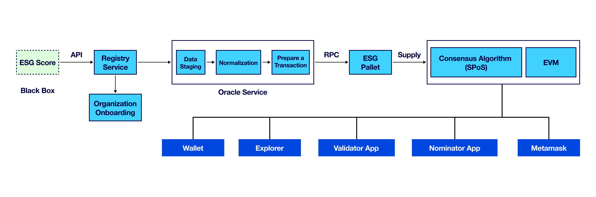

# 5ireChain
Table of Contents 

- [Introduction to 5ireChain](#1-introduction)
- [5ire Consensus](#2-5irechain-consensus)
    - [Election Process](#the-election-process)

    - [Reward Mechenism](#reward-calculation-and-distribution)

- [Features](#3-pallets-customization)

- [Roadmap](#5-roadmap)
    - [Phase 1 - Completed](#phase-1-completed---road-to-testnet)

    - [Phase 2 - Completed](#phase-2-ongoing---road-to-mainnet)

    - [Phase 3 - Near Future](#phase-3---near-future)
    - [Phase 4 - Road to an Integrated Economy](#phase-4---road-to-an-integrated-economy)

## **1. Introduction**

5ireChain is an EVM-compatible sustainability-oriented smart contract platform that focuses on developing a sustainable and for-benefit ecosystem based on the United Nations Sustainable Development Goals (UN SDGs) .To enable this, our goal is to build a computing platform that promotes and advocates these activities to achieve the goals.

5ireChain is a layer-1 blockchain ecosystem designed with economic and environmental sustainability at its core and is one of India's fastest-growing unicorns, enabled by a community of people worldwide.

5ireChain highlights many building blocks that can be combined to further create tools and schemes that can help make the shift from the fourth industrial revolution to the fifth. 5ire, thus, invites stakeholders, developers, legacy agencies, and users to be creative in how they utilize 5ireChain and interact with its ecosystem.

## **2. 5ireChain Consensus**

### **The Election Process**

The election process is done in an NPoS manner, and the rewards are calculated based on the ESG scores. This incentivizes a sustainable and ethical selection of validators that can positively contribute to the consensus protocol. Hence, nominators are expected to perform appropriate due diligence when selecting validators and diversify their nominated stake across multiple validators to secure the network and create a sustainable blockchain ecosystem.

The consensus protocol requires participating nodes (validators) in the consensus, to put monetary resources at risk as a security deposit. It calculates an active set of validators based on the overall amount of nominated stake that backs them. This calculation includes the validators’ own stake and the stake of other coin holders backing the validator. An important element of this algorithm is the financial incentive scheme that rewards validators who adhere to the protocol, while punishing negative behavior or misconduct.

The above diagram depicts the election input process for the SPoS mechanism. Nominators have varying amounts staked directly to the Validators. The nominators' staked amount provides accountability for the actions of Validators. The main objectives of this election process are ensuring decentralization, providing proportional and justified representation of validators, and providing robust security through full support. As a result of proportional and justified representation, slots can be provided to validators directly proportional to their nominations. The nomination amounts contribute to the overall number of coins available to stake on the validator and the higher the stake amount, the higher the probability for the validator to be elected into an active set. At the conclusion of every era, validators are elected (one era = one hour). The set of validators can be amended along with each era.

### **Reward Calculation and Distribution**

Reward payments can be processed when an era ends. The total reward of an era is the dividend of the total coin supply and the total number of coins staked by nominators within that era. The core emphasis on rewards is to allow and encourage users to stake coins at a specific rate. The users are requested to provide a payout of their personal rewards for reward redemption.

#### **Consider the following example:**

- Rewards per era: 200 5ire Coins
    
    Era (1 Era = 1 hour)
    
    Commission fee of the validator: 10%
    
    Five nominators (A, B, C, D, E) with the following stake each:
    
    - A: 20 5ire
        
        B: 10 5ire
        
        C: 40 5ire
        
        D: 60 5ire
        
        E: 70 5ire
        
        → Total stake backing the validator: 200 5ire
        
        Rewards: 200 5ire (total rewards) — 20 5ire (validator commission fee) = 180 5ire (remaining for nominators)
        
    
    Rewards per nominator:
    
    - A: 180 5ire (remaining rewards) x [20 5ire (stake of A) / 200 5ire (total stake of validator)] = 18 5ire
        
        B: 180 5ire (remaining rewards) x [10 5ire (stake of B) / 200 5ire (total stake of validator)] = 9 5ire
        
        C: 180 5ire (remaining rewards) x [40 5ire (stake of C) / 200 5ire (total stake of validator)] = 36 5ire
        
        D: 180 5ire (remaining rewards) x [60 5ire (stake of D) / 200 5ire (total stake of validator)] = 54 5ire
        
        E: 180 5ire (remaining rewards) x [70 5ire (stake of E) / 200 5ire (total stake of validator)] = 63 5ire
        

#### **Rewards and Slashing**

Integrated into the staking module is the reward and slashing module, which focuses on rewarding essential activities and penalizing any absence or misconduct during the specific era. The stakeholders eligible for a payout must claim rewards after leveraging the call of `payout_stakers` before they expire. A network participant has the authority to make this call that can automatically provide rewards to validators and nominators. If any misconduct is identified, slashing will occur. A specific value will be subtracted from the balance of the validator and all the participating nominators that were required to vote for the given penalized entity.

## **3. Pallets Customization** 

Along with default pallets, 5ireChain uses some customised pallet in order to achieve 5ireChain's consensus. We started from pallets used for NPOS(Nominated Proof Of Stake) and then customized and added few new pallets. The customised pallets include: 

### **Im Online Pallet:** 
Need to customize the whole pallet for Reliability Score. On-chain Storage, Pallet configuration and other functionalities for Relaibilty score are added.

### **Authority Discovery Pallet:**
In lib.rs, trait `OneSessionHandlerAll` is added and in cargo.toml, the required dependencies are added which are used in pallet im-online to calculate Reliability Score.

### **Babe Pallet:**
Trait `OneSessionHandlerAll` is added in lib.rs .

### **Grandpa Pallet:** 
Trait `OneSessionHandlerAll` is added in lib.rs .

### **Session Pallet:**
Trait `OneSessionHandlerAll` is added and implemented it into the lib.rs which will be used in pallet im-online.

### **Staking Pallet:**
Implemented ESG interface to convert the ESG score into weight and incorporate it as a factor in calculating rewards when validators stake in the network.

`NOTE` : `OneSessionHandlerAll` gets all validators in the network including active, waiting to calculate the Reliability Score.

### **Contract Pallet:**
Giving back 50 % gas fee for deployer

### **EVM Pallet:**
Giving back 50 % gas fee for deployer

### **Unified Address**
Replacing Ed25519 and Schnorr signatures (Substrate) with ECDSA (Elliptic Curve Digital Signature Algorithm) signatures (ETH) in a blockchain system.

Changes in the 5ireChain Codebase
+ **Update Primitives**: Modify the signature enumeration to include ECDSA and adjust the associated verification logic to ensure all components of the Substrate framework can recognize, handle, and verify ECDSA signatures correctly.
+ **Client-Side Implementation**: Update the key management system to generate and store ECDSA keys. Modify transaction signing processes to use ECDSA signatures for outgoing transactions.
+ **Account ID Compatibility**: Adjust the account ID structure to accommodate the size of ECDSA public keys, ensuring proper address generation, storage, and lookup functionality within the blockchain.

## **4. 5ire's pallets**

### **Esg Pallet:** 
An oracle loads the `ESG` score from off-chain storage to on-chain storage. Then `ESG` interface is tightly coupled with the other pallets and is used as a factor in calculating reward for validators and nominators.

### **Reward Pallet:**

+ The Reward Pallet is a module in the Substrate blockchain framework designed to manage and distribute rewards to participants based on their contributions within the network.

+ This pallet facilitates the allocation of rewards to validators and nominators for their involvement in staking activities.

## **5. Roadmap**

### Phase 1 (Completed) - Road to Testnet

#### Q4 2022: Thunder Testnet Alpha Launch
1. Initial launch of the 5ireChain Testnet, closed to the public.
2. Released items include:

    + Base blockchain with multiple validators
    + Base blockchain EVM compatibility
    + Base blockchain WASM compatibility
    + ESG module integrated with consensus mechanism (centralized)
    + Blockchain explorer
    + Web Wallet
    + EVM Faucet
    + WASM Faucet
    + Build on 5ire Documentation

#### Q2 2023: 5ire IDE
App for users to deploy solidity-based smart contracts on 5ire’s EVM chain.

#### Q2 2023: 5ire Wallet Extension
Dedicated 5ire Wallet Extension to interact to native and EVM chains for Google Chrome. Features:
1. Transfer
2. Swap
3. Deploy contracts
4. Sign transactions

#### Q2 2023: Thunder Testnet Beta Launch
1. Thunder Testnet released to the public.
2. Incorporating all features from the Thunder Testnet Alpha, plus the following:
+ Validator app for staking/bonding
+ Nominator app for staking

#### Q4 2023: TGE
1. Initial Exchange Offering (IEO) and listing on Bybit
2. Subsequent exchange listing:
- Gate.io
- MEXC

### Phase 2 (Completed) - Road to Mainnet

#### Q1 2024: Rewards Mechanism - SPoS & Reliability
Sustainable Proof-of-Stake (SPoS) and reliability mechanism -> consensus update to use fast-forward (BABE + GRANDPA) for selection, block production and validation and ESG scores used for rewards computation. Rewards are also generated for validator nodes with reliable uptime. Rewards distributed are in addition to standard PoS rewards based on stake.

#### Q1 2024: (Pending) Sustainability Scores Service
Service that persists an enterprise’s sustainability score on-chain. Based on ESG data provided, the service calculates an organization’s sustainability score that is subsequently pushed on-chain. The rewards mechanism uses the available sustainability score to determine alternate rewards.

#### Q1 2024: Thunder Testnet GA Launch
The Thunder Testnet General Availability (GA) launch provides all updates to previously released items from the Beta Testnet and other items:
1. 5ireChain Explorer 2.0
2. 5ireChain Validator app 2.0
3. 5ireChain Nominator app 2.0
4. 5ireChain Faucet 2.0
5. 5ire Wallet Extension v0.1.4 (Google Chrome & Mozilla Firefox)
6. Updated Rewards Mechanism (Sustainable Proof-of-stake and Reliability)
7. Sustainability Score service
8. Updated Build on 5ire Documentation

#### Q2 2024: Decentralized EVM Bridge
A decentralized bridge that allows for users to bridge 5ire tokens between the Ethereum network and the 5ire EVM network.

#### Q2 2024: (Pending) Secured Wallet Transactions
Enables secure wallet transactions for large amounts where the sender can generate a key to provide to the receiver (via social mechanisms), and funds are only released once the key is input on the receiver’s side.

#### Q2 2024: (Pending) Wallet Inheritance
Sustainable wealth transfer within a decentralized network. The feature allows a user to trigger the automatic transfer of asset ownership in a web3 wallet to another wallet, depending on the requirements and preferences of the owner.

#### Q2 2024: 5ireScan
An “EtherScan” style web app for 5ireChain to allow users to see any blocks, transactions, addresses or contracts on 5ireChain, and differentiate the explorer offering within the 5ireChain ecosystem.

#### Q2 2024: 5ireChain Mainnet Launch
Incorporating all features from the Thunder Testnet GA, plus the following items:
    1. Decentralized EVM bridge
    2. 5ire Wallet Extension upgrade
    3. 5ireScan
    4. Secured Transactions feature
    5. Wallet Inheritance feature

 

#### Q3 2024: Carbon Credit dApp
A third-party carbon credit app that allows enterprises to deploy, bridge, acquire and retire carbon credits on 5ireChain.

#### Q3 2024: Carbon Credit + Sustainability Service Integration
Update of the Sustainability Service to incorporate carbon credits retired on-chain to improve sustainability score, in real-time.

### Phase 3  - Near Future

#### Q1 2025: Decentralized Sustainability Corporate Rating (DSCR) Hub
A hub that enables enterprises to acquire a corporate sustainability rating report based on available sustainability data (ESG as a Service), with an onboarding process for enterprises to provide data.

### Phase 4  - Road to an Integrated Economy

#### Q2 2025: Data Brokerage for Nodes
Tools for onboarding sustainability data via nodes and generating rewards

#### Q3 2025: 5ire Enterprise Licensing & dApp Marketplace 
A dApp marketplace/ecosystem aimed at business use cases for enterprises, to help to navigate enterprises from Web2 to Web3 and foment enterprise data on 5ireChain.

#### Q4 2025: AI-driven Insights & Real-Time Monitoring in DSCR
Utilizing ESG data to provide insights that drive business decisions, by using AI and Machine Learning tools with 5ireChain data.

#### Q1 2026: Fully interconnected DSCR Hub
A fully interconnected infrastructure enabling data enrichment with 2nd and 3rd-party data partnerships.

